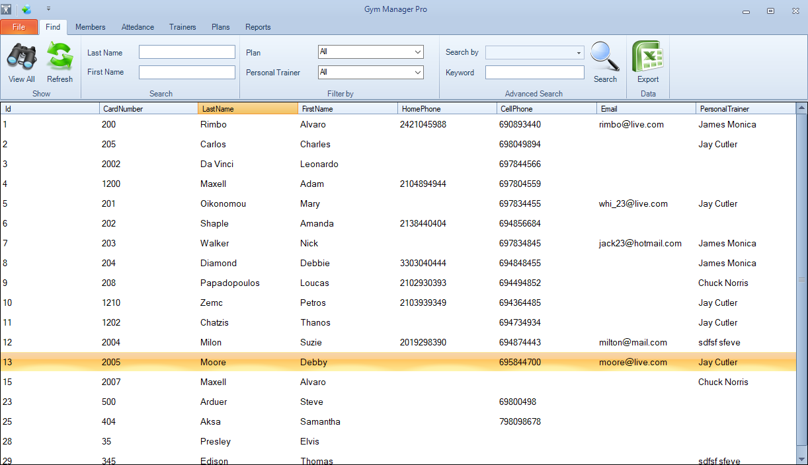
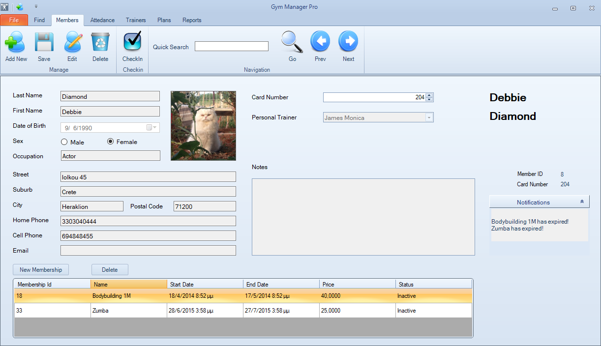

# GymManagerPro
=============

Membership management application for fitness club/gym business witten in C#,.NET, SQL Server.

- Model-View-Presenter design pattern.
- UI design with Windows Forms. It uses a modern Ribbon interface.
- CRUD and Search operations with ADO.NET.
- Fat-client architecture for portabillity and easy deployment.

The application manages every aspect of a gym business including client, employee, and membership management.

## Screenshots

